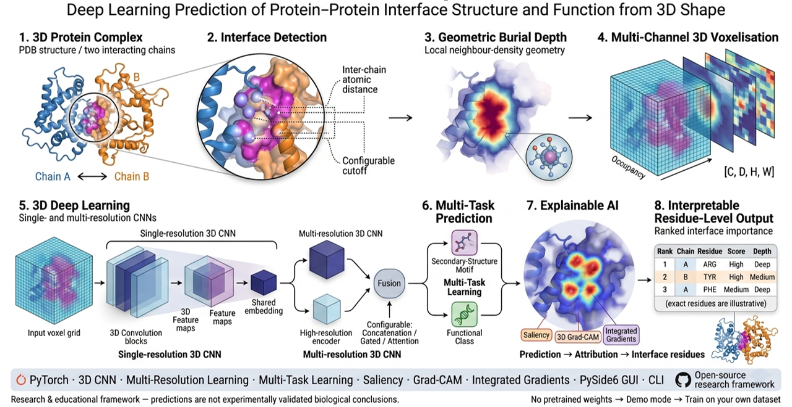
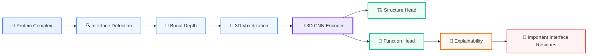

# InterfaceShapeAI
<p align="right">
  <a href="img/logo.png" target="_blank">
    
  </a>
</p>

**Deep Learning Prediction of Protein-Protein Interface Structure and Function from 3D Shape**


## Overview

InterfaceShapeAI is an open-source research framework for studying whether
protein-protein interface **geometry** and **local topology** encode
information about structural motifs and molecular function, using
interpretable 3D deep learning on voxelized interfaces enriched with
burial-depth information.

It provides a real, working PyTorch pipeline — structure parsing, interface
detection, burial-depth calculation, multi-channel 3D voxelization, single-
and multi-resolution 3D CNNs with multi-task heads, training/inference,
gradient-based explainability (saliency, Grad-CAM, Integrated Gradients), a
CLI, and a PySide6 desktop GUI — plus tests, CI, Docker, and documentation.

> This is a v0.1/v0.2 release. It is not a reimplementation or reproduction
> of any specific published method, dataset, or model weights.

## Scientific disclaimer

InterfaceShapeAI is a research and educational software framework.
Predictions should not be interpreted as experimentally validated biological
conclusions. Model performance depends strongly on the training dataset,
structural quality, class definitions, and preprocessing choices. **No
pretrained weights are shipped** — until you train on your own dataset, the
pipeline runs in demo mode with randomly initialized weights, which is
useful for testing the pipeline but is *not* scientifically meaningful.

## Architecture



## Installation

```bash
python -m venv .venv
. .venv/Scripts/activate   # Windows PowerShell: .venv\Scripts\Activate.ps1
pip install --extra-index-url https://download.pytorch.org/whl/cpu -e ".[dev]"
```

See [docs/installation.md](docs/installation.md) for Conda and Docker
options.

## Quickstart

```bash
# Synthetic demo data (DEMO DATA - NOT FOR SCIENTIFIC BENCHMARKING)
python scripts/generate_example_dataset.py --output data/examples/synthetic

# Detect an interface between two chains of a structure you provide
interfaceshapeai interface --input complex.pdb --chain-a A --chain-b B

# Voxelize it
interfaceshapeai voxelize --pdb complex.pdb --chain-a A --chain-b B --output interface.pt

# Run inference (demo mode without a trained checkpoint)
interfaceshapeai predict --input complex.pdb --chain-a A --chain-b B

# Explain the prediction (saliency / Grad-CAM / Integrated Gradients)
interfaceshapeai explain --input complex.pdb --chain-a A --chain-b B --method gradcam

# Launch the GUI
interfaceshapeai gui
```

See [docs/quickstart.md](docs/quickstart.md) for a step-by-step walkthrough.

## CLI

```
interfaceshapeai gui
interfaceshapeai interface --input complex.pdb --chain-a A --chain-b B [--distance-cutoff 5.0] [--output out.json]
interfaceshapeai voxelize  --pdb complex.pdb --chain-a A --chain-b B --output interface.pt
interfaceshapeai predict   --input complex.pdb --chain-a A --chain-b B [--model checkpoint.pt]
interfaceshapeai explain   --input complex.pdb --chain-a A --chain-b B [--model checkpoint.pt]
                           [--target dna_binding] [--method saliency|gradcam|integrated_gradients]
```

`explain` is currently implemented for `model.architecture: cnn3d` only;
multi-resolution explainability is on the roadmap.

Every subcommand accepts `--config path/to/config.yaml` (see
`configs/default.yaml`).

## GUI

The PySide6 desktop app walks through five tabs in order: **Structure**
(upload + chain selection) → **Interface** (contact-based detection) →
**Voxelize** (3D grid generation) → **Predict** (model inference, clearly
labeled as demo mode when no checkpoint is loaded) → **Explain** (saliency /
Grad-CAM / Integrated Gradients, ranked residue-importance table).

## Data preparation & voxelization

Interface residues are found by inter-chain atomic distance (configurable
cutoff and atom definition). Burial depth is a documented, purely geometric
neighbor-density metric (no external binaries required in v0.1). Interfaces
are voxelized into a `[C, D, H, W]` tensor with configurable voxel size, grid
size, and feature channels (`occupancy`, `burial_depth`, `hydrophobicity`,
`charge`, `aromaticity`). Full formulas: [docs/methodology.md](docs/methodology.md).

## Model architecture

Two real architectures are registered in `models.factory.MODEL_REGISTRY`:
a single-resolution 3D CNN (`cnn3d`) and a two-stage multi-resolution 3D CNN
(`multires_cnn`, high-res + low-res encoders with concatenation/gated/
attention fusion) — both with a shared embedding and two task-specific heads
(secondary-structure motif, functional class). See
[docs/methodology.md](docs/methodology.md) for the fusion-method equations.
Residual and single-resolution attention variants remain on the roadmap.

## Training

```bash
python -c "
from interfaceshapeai.utils.config import load_config
from interfaceshapeai.utils.seed import set_seed
# see src/interfaceshapeai/training/trainer.py for train_one_epoch,
# build_optimizer, save_checkpoint building blocks
"
```

`train_one_epoch` is architecture-aware: it dispatches on the batch's keys
(`voxel` for `cnn3d`, or `voxel_high`/`voxel_low` for `multires_cnn`, see
`datasets.voxel_dataset.MultiResVoxelDataset`), so the same training loop
drives either architecture. `MultiTaskLoss` supports per-task loss selection
(`cross_entropy`, `focal`, `label_smoothing`, and multi-label `bce` for the
function head — see `configs/multires.yaml`). A full
`interfaceshapeai train --config ...` CLI subcommand (train/val split, early
stopping, scheduler, full multi-epoch loop) is still planned for v0.3; the
underlying `train_one_epoch`, `MultiTaskLoss`, and `save_checkpoint`
functions are real and unit-tested today (`tests/test_training.py`,
`tests/test_multires_dataset.py`, `tests/test_losses.py`).

## Prediction & explainability

`interfaceshapeai predict` runs the trained (or demo-mode) model end to end
from a raw structure file. `interfaceshapeai explain` (and the GUI's
**Explain** tab) runs real gradient-based attribution — saliency, Grad-CAM
3D, or Integrated Gradients — on the `cnn3d` architecture, then maps the
resulting per-voxel importance back onto interface residues, producing a
ranked rank/chain/residue/score/depth/feature table (see
[docs/methodology.md](docs/methodology.md)). Multi-resolution explainability
is on the v0.3 roadmap.

## Evaluation

Per-batch accuracy and macro-F1 are implemented per task
(`training.metrics.task_metrics`); a full evaluation CLI/report (confusion
matrix, AUROC/AUPRC, calibration) is planned for v0.3.

## Example workflow

```
complex.pdb -> load_structure() -> select_chain_pair() -> detect_interface()
            -> geometric_burial_depth() -> voxelize_interface()
            -> Predictor.predict()
```

## Project structure

```
src/interfaceshapeai/
├── structure/       # parsing, chain selection, interface detection
├── geometry/        # burial depth, voxelization (single + multi-resolution)
├── features/        # residue chemistry lookup tables
├── datasets/        # voxel tensor + label loading (single + multi-resolution)
├── models/          # 3D CNN, multi-resolution CNN + fusion, model registry
├── training/        # losses (CE/focal/label-smoothing/BCE), metrics, training loop
├── inference/       # predictor, preprocessing helpers
├── explainability/  # saliency, Grad-CAM 3D, Integrated Gradients, residue mapping
├── app/             # PySide6 GUI
├── utils/           # config, device, logging, seeding
└── cli.py
tests/             # pytest suite, tiny synthetic fixtures
scripts/           # synthetic dataset generator
configs/           # YAML configuration
docs/              # methodology and usage docs
```

## Reproducibility

Every checkpoint saved by `training.trainer.save_checkpoint` stores the model
and optimizer state, epoch, metrics, full config, random seed, and software
versions (Python/PyTorch/platform) alongside the weights.

## Limitations

- No pretrained weights; demo-mode predictions/explanations are not
  scientifically meaningful.
- No DSSP/FreeSASA-derived solvent accessibility (burial depth is purely
  geometric).
- No residual or single-resolution attention architectures yet.
- Explainability (`explain` CLI subcommand, GUI Explain tab) supports the
  `cnn3d` architecture only; multi-resolution explainability is not
  implemented.
- No full multi-epoch `train` CLI subcommand yet (the underlying training
  building blocks are real and tested; only per-epoch/scripted training is
  wired up today).
- No interactive 3D (PyVista) structure/saliency viewer yet — the GUI shows
  tabular results.
- No real training dataset is bundled; `scripts/generate_example_dataset.py`
  produces synthetic data for pipeline testing only.

## Citation

See [CITATION.cff](CITATION.cff).

## License

[MIT](LICENSE)

## Contributing

Issues and pull requests are welcome. Please run `pytest -q`, `ruff check`,
and `black --check` before submitting.

## Roadmap

- **v0.1**: interface detection, geometric burial depth, voxelization, basic
  3D CNN, CLI, PySide6 GUI shell, tests, CI, Docker.
- **v0.2** (this release): multi-resolution/two-stage CNN with configurable
  fusion (concatenation/gated/attention), multi-task loss options
  (focal/label-smoothing/multi-label BCE), explainability (saliency,
  Grad-CAM 3D, Integrated Gradients) with residue-importance mapping and a
  GUI Explain tab.
- **v0.3**: full multi-epoch `train` CLI subcommand, DSSP/FreeSASA burial
  depth, PyVista 3D viewer (with saliency overlay), large-scale dataset
  pipeline (leakage-safe splitting), embedding clustering, ablation studies.
- **v0.4**: pretrained models, transfer learning, protein language-model
  features.
- **v0.5**: multi-chain complexes, graph + voxel hybrid models.

Potential future directions: SE(3)-equivariant networks, 3D vision
transformers, geometric deep learning / graph neural networks, protein
language-model embeddings.
